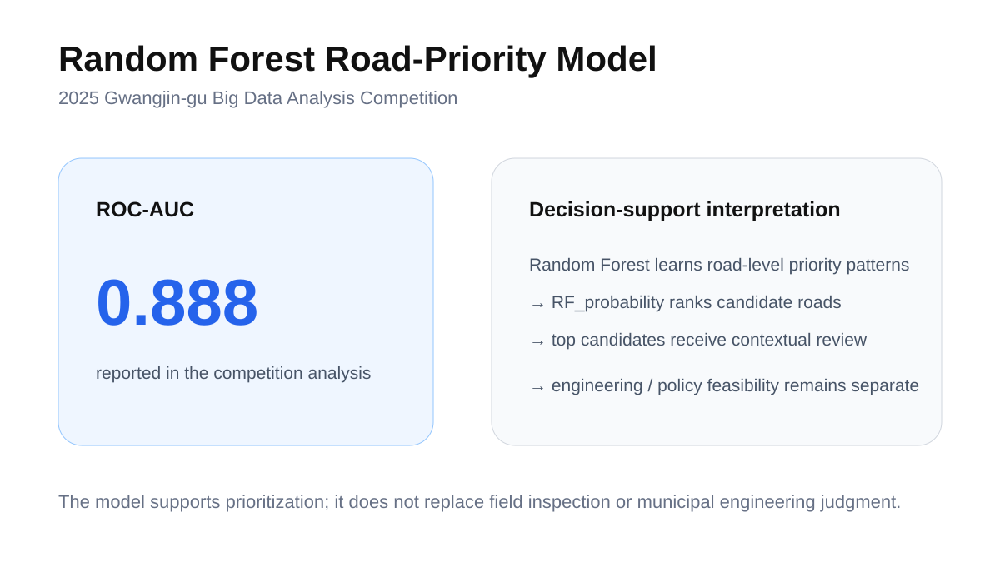
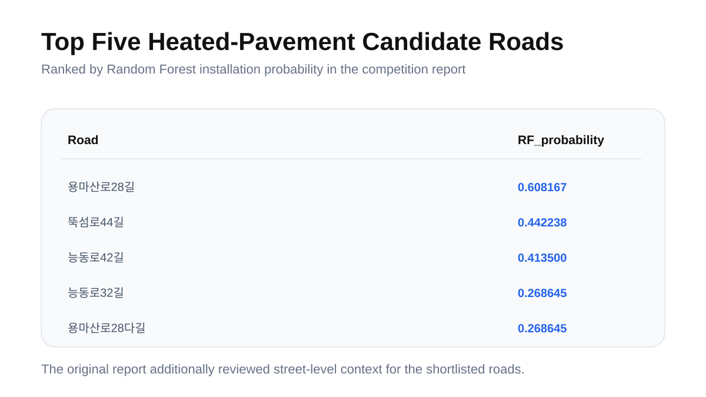

# Risk-Based Prioritization of Heated Pavement Deployment

> A spatial machine-learning framework for prioritizing heated-pavement installation using road, accident, weather, and facility data.

**Period:** May. 2025  
**Domain:** Spatial data analysis · Public safety  
**Core methods:** Random Forest · PCA · KD-Tree  
**Output:** Ranked candidate road segments for heated-pavement deployment

---

## Overview

Heated pavement can reduce winter road hazards, but installation resources are limited. This project therefore framed deployment as a **risk-based prioritization problem**.

The analysis integrated road, accident, weather, and facility data, constructed road-level spatial features, and used a **Random Forest–based risk model** to estimate relative installation priority.

The portfolio framing can be summarized as:

**road + accident + weather + facility data → spatial ML risk score → deployment priority**.

## Data integration

The analysis combined public datasets related to:

- road characteristics
- traffic / accident information
- weather and winter-risk conditions
- nearby facilities and contextual infrastructure
- spatial coordinates and road-segment relationships

## Spatial preprocessing

**PCA** and **KD-Tree**–based processing were used to organize heterogeneous spatial variables and map contextual information to road-level analysis units.

The goal was to transform datasets with different scales and coordinate structures into a consistent feature space for risk modeling.

## Modeling workflow

1. Collect and preprocess road, accident, weather, and facility data.
2. Construct road-level explanatory variables.
3. Apply spatial preprocessing and feature construction using **PCA** and **KD-Tree**.
4. Train a **Random Forest** model for relative installation-priority estimation.
5. Rank candidate road segments using model output.
6. Review the highest-ranked roads in their actual spatial context.

## Main result

The competition-stage analysis reported a **Random Forest AUC of 0.888**.

The model output was converted into a ranked list of candidate road segments rather than treated as an automatic infrastructure decision.

## Candidate prioritization

The highest-priority roads were reviewed together with their geometry and surrounding context to support a more interpretable deployment recommendation.

## Decision-support interpretation

This project demonstrates how spatial machine learning can support allocation of limited infrastructure resources. The ranking should be interpreted as a **screening / decision-support result**, not as a substitute for engineering inspection or municipal feasibility review.

## Limitations

- Different update cycles across public datasets
- Potential coordinate / spatial matching error
- Limited availability of detailed road-width and road-environment information
- Imbalance in road-type representation
- Engineering and municipal feasibility were outside the model scope

## Public outputs

- [`outputs/heated-pavement-analysis-public-excerpt.pdf`](outputs/heated-pavement-analysis-public-excerpt.pdf) — concise public-safe technical excerpt derived from the competition report.
- [`outputs/PROJECT_OUTPUTS.md`](outputs/PROJECT_OUTPUTS.md) — source provenance, top-road ranking, and public-release notes.

---

**Junha Won** · Ajou University  
[Portfolio detail](https://juna0926.github.io/Portfolio/projects/gwangjin.html) · [Portfolio](https://juna0926.github.io/Portfolio/) · [GitHub](https://github.com/Juna0926)
